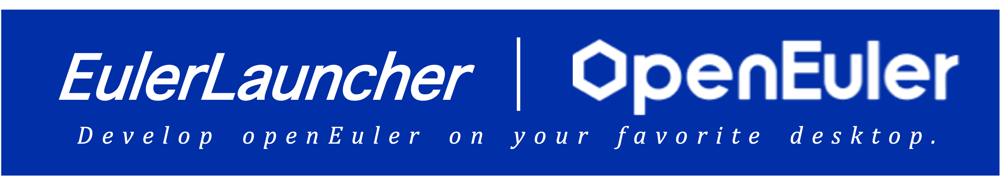

----

# EulerLauncher

**EulerLauncer**是由openEuler社区技术运营团队及基础设施团队孵化的开发者工具集，通过对主流桌面操作系统中的虚拟化技术(LXD、HyperV、Virtualization framework)等技术进行有机整合，使用openEuler社区官方发布的虚拟机、容器镜像，为开发者在Windows、MacOS、Linux上提供统一的开发资源(虚拟机、容器)发放和管理体验，提升主流桌面操作系统上openEuler开发环境使用的便利性和稳定性，有效提升开发者体验。

*P.S:* *EulerLauncher曾用名OmniVirt，目前项目各类文档等内容正在更名中*

## 背景 & 简介

主流桌面操作系统上提供相关开发资源(虚拟机、容器等)的便利性和稳定性是影响openEuler开发者体验的重要因素，尤其是对于对开发资源受限的个人及高校开发者openEuler开发体验影响更为明显。当前常见的虚拟机管理平台有诸多局限性，如VirtualBox需要下载体积庞大的ISO镜像，同时需要进行操作系统安装等相关操作，WSL无法提供真实的openEuler内核，绝大多数虚拟机管理软件目前对Apple Sillicon芯片支持尚不完善且众多软件需要付费等，这些都极大的降低了开发者的工作效率。

**EulerLauncher**支持在Windows、MacOS及Linux(规划中)等主流桌面操作系统上提供方便、易用、统一体验的开发者工具集，硬件架构支持x86_64及Aarch64(包含Apple Sillicon系列芯片)；并支持各平台对应的虚拟化硬件加速能力，为开发者提供高性能的开发资源。**EulerLauncher**支持使用openEuler社区发布的虚拟机、容器(规划中)镜像、openEuler社区提供的Daily Build镜像以及其他符合要求的自定义镜像，为开发者提供多种选择。

## 快速开始

**EulerLauncher** MacOS用户请参考[MacOS用户指导文档][1]
**EulerLauncher** Win用户请参考[Windows用户指导文档][2]

[1]: ./docs/mac-user-manual.md
[2]: ./docs/win-user-manual.md