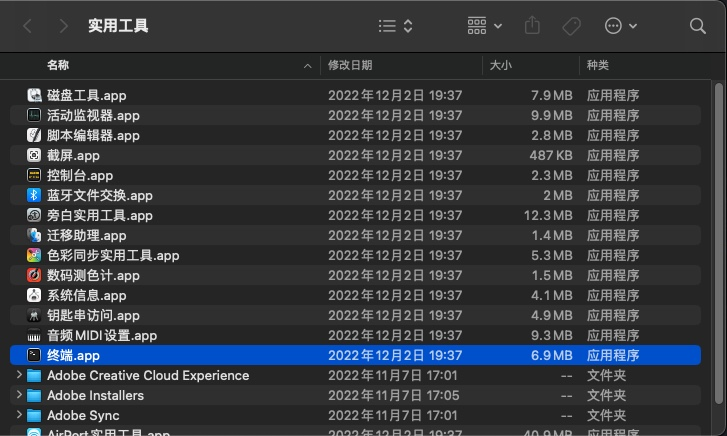
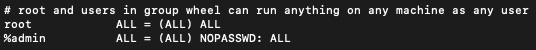
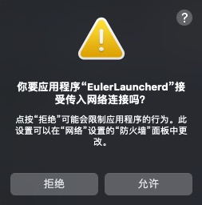

# Installing and Running EulerLauncher on macOS

## Preparations

### Installing Homebrew

Homebrew is the software package manager for macOS, which provides many practical functions, such as installation, uninstallation, update, viewing, and search. It allows you to use a simple command to manage packages without considering dependencies and file paths.

On the macOS desktop, press **Shift**+**Command**+**U** to open the **Utilities** folder in **Go** and find **Terminal.app**. 



Install Homebrew based on the network status.

Run the following command to install Homebrew:

``` Shell
/bin/bash -c "$(curl -fsSL https://raw.githubusercontent.com/Homebrew/install/HEAD/install.sh)"
```

Alternatively, run the following command to install Homebrew:

``` Shell
/bin/zsh -c "$(curl -fsSL https://gitee.com/cunkai/HomebrewCN/raw/master/Homebrew.sh)"
```

### Installing QEMU and Wget

EulerLauncher depends on QEMU to run on macOS, and image download depends on Wget. Homebrew can be used to easily download and manage such software. Run the following command to install QEMU and Wget:

``` Shell
brew install qemu
brew install wget
```

### Configuring the sudo Password-Free Permission

EulerLauncher depends on QEMU to run on macOS. To improve user network experience, [vmnet framework][1] of macOS is used to provide VM network capabilities. Currently, administrator permissions are required for using vmnet. When using the QEMU backend to create VMs with vmnet network devices, you need to enable the administrator permission. EulerLauncher automatically uses the `sudo` command to implement this process during startup. Therefore, you need to configure the `sudo` password-free permission for the current user. If you do not want to perform this configuration, please stop using EulerLauncher.

1. On the macOS desktop, press **Shift**+**Command**+**U** to open the **Utilities** folder in **Go** and find **Terminal.app**. 

    

2. Enter `sudo visudo` in the terminal to modify the sudo configuration file. Note that you may be required to enter the password in this step. Enter the password as prompted.

3. Find and replace `%admin ALL=(ALL) ALL` with `%admin ALL=(ALL) NOPASSWD: ALL`. 
 
    

4. Press **ESC** and enter **:wq** to save the settings.

## Installing EulerLauncher

EulerLauncher supports macOS Ventura for Apple Silicon and x86 architectures. [Download the latest version of EulerLauncher][1] for macOS and decompress it to the desired location.

The directory generated after the decompression contains the following files:


**install.exe** is the installation file, which is used to install the support files required by EulerLauncher to the specified location. **EulerLauncher.dmg** is the disk image of the main program.

1. This operation requires the `sudo` permission. You need to [configure the sudo password-free permission](#configuring-the-sudo-password-free-permission) first.
2. Install the support files. Double-click the **install** file and wait until the program execution is completed.

3. Configure EulerLauncher.

    - Check the locations of QEMU and Wget. The name of the QEMU binary file varies according to the architecture. Select the correct name (Apple Silicon: **qemu-system-aarch64**; Intel: **qemu-system-x86_64**) as required.

        ``` Shell
        which wget
        which qemu-system-{host_arch}
        ```

        Reference output:

        ```shell
        /opt/homebrew/bin/wget
        /opt/homebrew/bin/qemu-system-aarch64
        ```

        Record the paths, which will be used in the following steps.

    - Open the **eulerlauncher.conf** file and configure it.

        ```shell
        sudo vi /Library/Application\ Support/org.openeuler.eulerlauncher/eulerlauncher.conf
        ```

        EulerLauncher configurations are as follows:

        ```ini
        [default]
        log_dir = # Log file location (xxx.log)
        work_dir = # EulerLauncher working directory, which is used to store VM images and VM files.
        wget_dir = # Path of the Wget executable file. Set this parameter based on the previous step.
        qemu_dir = # Path of the QEMU executable file. Set this parameter based on the previous step.
        debug = True

        [vm]
        cpu_num = 1 # Number of CPUs of the VM.
        memory = 1024 #Memory size of the VM, in MB. Do not set this parameter to a value greater than 2048 for M1 users.
        ```

        Save the modifications and exit.

4. Install **EulerLauncher.app**.

    - Double-click **EulerLauncher.dmg**. In the displayed window, drag **EulerLauncher.app** to **Applications** to complete the installation. You can find **EulerLauncher.app** in applications.

        

## Using EulerLauncher

1. Find **EulerLauncher.app** in applications and click to start the program.

2. EulerLauncher needs to access the network. When the following dialog box is displayed, click **Allow**.

    

3. Currently, EulerLauncher can be accessed only in CLI mode. Open **Terminal.app** and use the CLI to perform operations.

### Operations on Images

1. List available images.

    ```Shell
    eulerlauncher images
    ```

    There are two types of EulerLauncher images: remote images and local images. Only local images in the **Ready** state can be used to create VMs. Remote images can be used only after being downloaded. You can also load a downloaded local image to EulerLauncher. For details, see the following sections.

2. Download a remote image.

    ```Shell
    eulerlauncher download-image 23.09

    Downloading: 23.09, this might take a while, please check image status with "images" command.
    ```

    The image download request is an asynchronous request. The download is completed in the background. The time required depends on your network status. The overall image download process includes download, decompression, and format conversion. During the download, you can run the `image` command to view the download progress and image status at any time.

    ```Shell
    eulerlauncher images
    ```

    When the image status changes to **Ready**, the image is downloaded successfully. The image in the **Ready** state can be used to create VMs.

    ```Shell
    eulerlauncher images
    ```

3. Load a local image.

    Load a custom image or an image downloaded to the local host to EulerLauncher to create a custom VM.

    ```Shell
    eulerlauncher load-image --path {image_file_path} IMAGE_NAME
    ```

    The supported image formats are *xxx***.qcow2.xz** and *xxx***.qcow2**.

    Example:

    ```Shell
    eulerlauncher load-image --path /opt/openEuler-23.09-x86_64.qcow2.xz 2309-load

    Loading: 2309-load, this might take a while, please check image status with "images" command.
    ```

    Load the **openEuler-23.09-x86_64.qcow2.xz** file in the **/opt** directory to the EulerLauncher system and name it **2309-load**. Similar to the download command, the load command is also an asynchronous command. You need to run the image list command to query the image status until the image status is **Ready**. Compared with directly downloading an image, loading an image is much faster.

    ```Shell
    eulerlauncher images
    ......

    eulerlauncher images
    ......
    ```

4. Delete an image.

    Run the following command to delete an image from the EulerLauncher system:

    ```Shell
    eulerlauncher delete-image 2309-load

    Image: 2309-load has been successfully deleted.
    ```

### Operations on VMs

1. List VMs.

    ```shell
    eulerlauncher list

    +----------+-----------+---------+---------------+
    |   Name   |   Image   |  State  |       IP      |
    +----------+-----------+---------+---------------+
    |   test1  | 2309-load | Running | 172.22.57.220 |
    +----------+-----------+---------+---------------+
    |   test2  | 2309-load | Running |      N/A      |
    +----------+-----------+---------+---------------+
    ```

    If the VM IP address is **N/A** and the VM status is **Running**, the VM is newly created and the network configuration is not complete. Configuring the network takes several seconds. You can obtain the VM information again later.

2. Log in to a VM.

    If an IP address has been assigned to a VM, you can run the `ssh` command to log in to the VM.

    ```Shell
    ssh root@{instance_ip}
    ```

    If the official image provided by the openEuler community is used, the default username is **root** and the default password is **openEuler12#$**.

3. Create a VM.

    ```Shell
    eulerlauncher launch --image {image_name} {instance_name}
    ```

    Use `--image` to specify an image and a VM name.

4. Delete a VM.

    ```Shell
    eulerlauncher delete-instance {instance_name}
    ```

Delete a specified VM based on the VM name.

[1]: https://developer.apple.com/documentation/vmnet

