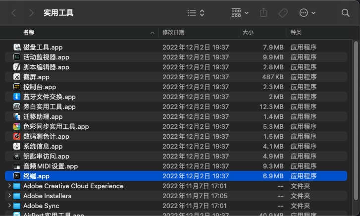
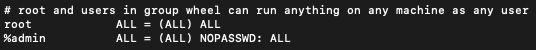
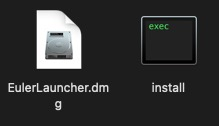
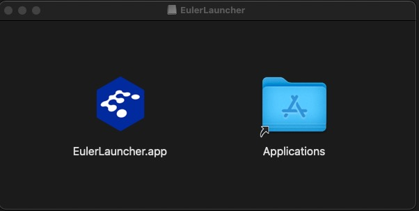
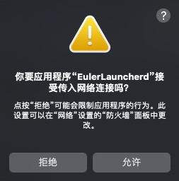

# 在MacOS下安装与运行EulerLauncher

## 准备工作

### 安装Homebrew

Homebrew是一款Mac OS平台下的软件包管理工具，拥有安装、卸载、更新、查看、搜索等很多实用的功能。简单的一条指令，就可以实现包管理，而不用你关心各种依赖和文件路径的情况，十分方便快捷。

在MacOS桌面下敲击 `command` + `shift` + `u` 组合键，打开`访达`中的`实用工具`，并找到`终端.app`


并根据网络情况输入以下命令进行安装

可以使用以下命令安装Homebrew:
``` Shell
/bin/bash -c "$(curl -fsSL https://raw.githubusercontent.com/Homebrew/install/HEAD/install.sh)"
```

由于国内网络原因，可能需要修改源到国内源以进行安装：
``` Shell
/bin/zsh -c "$(curl -fsSL https://gitee.com/cunkai/HomebrewCN/raw/master/Homebrew.sh)"
```

### 安装Qemu及wget

**EulerLauncher**在MacOS上运行依赖于`QEMU`，镜像下载依赖于`wget`，使用`Homebrew`可以非常方便的下载和管理此类软件，使用以下命令进行安装：

``` Shell
brew install qemu
brew install wget
```

### 配置sudo免密码权限

**EulerLauncher**在MacOS上运行依赖于`QEMU`，为了使用户的网络体验更加优秀，因此采用了MacOS的[vmnet framework][1]来提供虚拟机的网络能力，当前`vmnet`使用时需要使用管理员权限，因此在使用`QEMU`后端创建带有`vmnet`类型网络设备的虚拟机时，需要启用管理员权限，EulerLauncher在启动时会自动使用`sudo`命令来实现这一过程，因此需要为当前用户配置`sudo`免密码使用权限，如您介意此配置，请停止使用EulerLauncher。

1. 在MacOS桌面下敲击 `command` + `shift` + `u` 组合键，打开`访达`中的`实用工具`，并找到`终端.app`


2. 在终端中输入`sudo visudo`修改sudo配置文件，注意，此步骤有可能要求输入密码，请按指示输入密码。

3. 找到并将`%admin ALL=(ALL) ALL`替换为 `%admin ALL=(ALL) NOPASSWD: ALL`


4. 敲击`ESC`，再输入`:WQ`进行保存

## 安装EulerLauncher

**EulerLauncher**当前支持MacOS Ventura, 支持Apple Silicon芯片版及x86芯片版，前往[EulerLauncher最新版下载][2]下载MacOS版软件包并解压到期望的位置。

解压后的目录包含以下文件：



其中`install`可执行文件为安装文件，用于将**EulerLauncher**所需支持文件安装到指定位置，`EulerLauncher.dmg`为主程序的磁盘映象。

1. 安装支持文件(本操作需要sudo权限，请先完成前面的步骤)：双击`install`可执行文件，等待程序完成执行。

2. 配置**EulerLauncher**：

    - 查看`qemu`,`qemu-img`及`wget`所处位置，`qemu`二进制文件在不同架构下名称不同，请根据自身情况选择正确的名称(Apple Silicon: qemu-system-aarch64; Intel: qemu-system-x86_64)：
        ``` Shell
        which wget
        which qemu-system-{host_arch}
        which qemu-img
        ```
        参考输出：
        ```
        /opt/homebrew/bin/wget
        /opt/homebrew/bin/qemu-system-aarch64
        /opt/homebrew/bin/qemu-img
        ```
        查看完成后，记录路径结果，在接下来的步骤中将会使用到。

    - 打开`eulerlauncher.conf`并进行配置：
        ``` Shell
        sudo vi /Library/Application\ Support/org.openeuler.eulerlauncher/eulerlauncher.conf
        ```

        eulerlauncher的配置如下
        ```
        [default]
        log_dir = # 日志文件位置(xxx.log)
        work_dir = # eulerlauncher工作目录，用于存储虚拟机镜像、虚拟机文件等
        wget_dir = # wget的可执行文件路径，请参考上一步的内容进行配置
        qemu_dir = # qemu的可执行文件路径，请参考上一步的内容进行配置
        qemu_img_dir = # qemu-img的可执行文件路径，请参考上一步的内容进行配置
        debug = True

        [vm]
        cpu_num = 1 # 配置虚拟机的CPU个数
        memory = 1024 # 配置虚拟机的内存大小，单位为M，M1用户请勿配置超过2048
        ```

3. 安装**EulerLauncher.app**:

    - 双击`EulerLauncher.dmg`，在弹出的窗口中用鼠标将`EulerLauncher.app`拖动到`Applications`中，即可完成安装，并可在应用程序中找到`EulerLauncher.app`

        

## 使用EulerLauncher

1. 在应用程序中找到`EulerLauncher.app`，单击启动程序。

2. EulerLauncher需要访问网络，在弹出如下窗口时点击`允许`:

    

3. EulerLauncher当前仅支持命令行方式进行访问，请打开`终端.app`，使用命令行进行操作。

### 镜像操作

1. 获取可用镜像列表：
```Shell
eulerlauncher images

+-----------+----------+--------------+
|   Images  | Location |    Status    |
+-----------+----------+--------------+
| 22.03-LTS |  Remote  | Downloadable |
|   21.09   |  Remote  | Downloadable |
| 2203-load |  Local   |    Ready     |
+-----------+----------+--------------+
```

**EulerLauncher**镜像有两种位置属性：1）远端镜像 2）本地镜像，只有处于本地且状态为 `Ready` 的镜像可以直接用来创建虚拟机，位于远端的镜像需要下载后才能够使用；你也可以加载已经预先下载好的本地镜像到**EulerLauncher**中，具体操作方法可以参考接下来的操作指导。

2. 下载远端镜像

```Shell
eulerlauncher download-image 22.03-LTS

Downloading: 22.03-LTS, this might take a while, please check image status with "images" command.
```

镜像下载请求是一个异步请求，具体的下载动作将在后台完成，具体耗时与你的网络情况相关，整体的镜像下载流程包括下载、解压缩、格式转换等相关子流程，在下载过程中可以通过 `image` 命令随时查看下载进展与镜像状态，进度条格式为`([downloaded_bytes] [percentage] [download_speed] [remaining_download_time])`：

```Shell
eulerlauncher images

+-----------+----------+------------------------------------+
|   Images  | Location |               Status               |
+-----------+----------+------------------------------------+
| 22.03-LTS |  Remote  |            Downloadable            |
|   21.09   |  Remote  |            Downloadable            |
| 22.03-LTS |  Local   | Downloading: 33792K  8% 4.88M 55s  |
+-----------+----------+------------------------------------+
```


当镜像状态转变为 `Ready` 时，表示镜像下载完成，处于 `Ready` 状态的镜像可被用来创建虚拟机：

```Shell
eulerlauncher images

+-----------+----------+--------------+
|   Images  | Location |    Status    |
+-----------+----------+--------------+
| 22.03-LTS |  Remote  | Downloadable |
|   21.09   |  Remote  | Downloadable |
| 22.03-LTS |  Local   |    Ready     |
+-----------+----------+--------------+
```

3. 加载本地镜像

用户也可以加载自定义镜像或预先下载到本地的镜像到EulerLauncher中用于创建自定义虚拟机：

```Shell
eulerlauncher load-image --path {image_file_path} IMAGE_NAME
```

当前支持加载的镜像格式有 `xxx.{qcow2, raw, vmdk, vhd, vhdx, qcow, vdi}.[xz]`

例如：

```Shell
eulerlauncher load-image --path /opt/openEuler-22.03-LTS-x86_64.qcow2.xz 2203-load

Loading: 2203-load, this might take a while, please check image status with "images" command.
```

将位于 `/opt` 目录下的 `openEuler-22.03-LTS-x86_64.qcow2.xz` 加载到EulerLauncher系统中，并命名为 `2203-load`，与下载命令一样，加载命令也是一个异步命令，用户需要用镜像列表命令查询镜像状态直到显示为 `Ready`, 但相对于直接下载镜像，加载镜像的速度会快很多：

```Shell
eulerlauncher images

+-----------+----------+----------------------------+
|   Images  | Location |           Status           |
+-----------+----------+----------------------------+
| 22.03-LTS |  Remote  |       Downloadable         |
|   21.09   |  Remote  |       Downloadable         |
| 2203-load |  Local   |   Loading: (24.00/100%)    |
+-----------+----------+----------------------------+

eulerlauncher images

+-----------+----------+--------------+
|   Images  | Location |    Status    |
+-----------+----------+--------------+
| 22.03-LTS |  Remote  | Downloadable |
|   21.09   |  Remote  | Downloadable |
| 2203-load |  Local   |     Ready    |
+-----------+----------+--------------+
```

4. 删除镜像：

通过下面的命令将镜像从EulerLauncher系统中删除：

```Shell
eulerlauncher delete-image 2203-load

Image: 2203-load has been successfully deleted.
```

### 虚拟机操作

1. 获取虚拟机列表：

```shell
eulerlauncher list

+----------+-----------+---------+---------------+
|   Name   |   Image   |  State  |       IP      |
+----------+-----------+---------+---------------+
|   test1  | 2203-load | Running | 172.22.57.220 |
+----------+-----------+---------+---------------+
|   test2  | 2203-load | Running |      N/A      |
+----------+-----------+---------+---------------+
```

若虚拟机IP地址显示为 `N/A` ，若这台虚拟机的状态为 `Running` 则表示这台虚拟机为新创建的虚拟机，网络还未配置完成，网络配置过程大概需要若干秒，请稍后重新尝试获取相关虚拟机信息。

2. 登录虚拟机：

若虚拟机已成功分配到IP地址，可以直接使用 `SSH` 命令进行登录：

```Shell
ssh root@{instance_ip}
```
若使用的是openEuler社区提供的官方镜像，则默认用户为 `root` 默认密码为 `openEuler12#$`

3. 创建虚拟机

```Shell
eulerlauncher launch --image {image_name} {instance_name}
```

通过 `--image` 指定镜像，同时指定虚拟机名称。

4. 删除虚拟机
```Shell
eulerlauncher delete-instance {instance_name}
```
根据虚拟机名称删除指定的虚拟机。

5. 为虚拟机打快照，并导出为镜像
```Shell
eulerlauncher take-snapshot --snapshot_name snap --export_path path vm_name
```
通过`--snapshot_name`指定快照名称，`--export_path`指定导出镜像存放位置，`vm_name`为虚拟机名。

6. 将虚拟机导出为主流编程框架开发镜像
```Shell
eulerlauncher export-development-image --image_name image --export_path path vm_name
```
通过`--image_name`指定导出镜像名称，`--export_path`指定导出镜像存放位置，`vm_name`为虚拟机名，默认导出为Python/Go/Java主流编程框架开发镜像。

[1]: https://developer.apple.com/documentation/vmnet
[2]: https://gitee.com/openeuler/eulerlauncher/releases