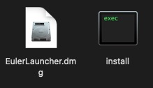
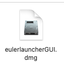
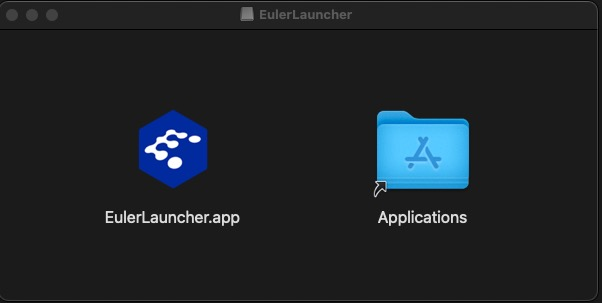
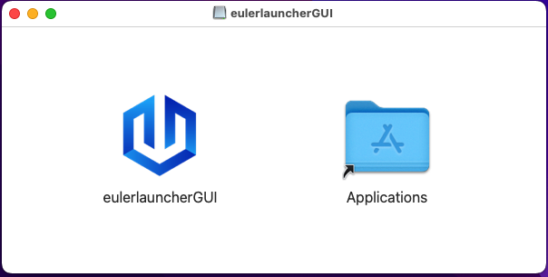

# 在MacOS下安装与运行EulerLauncher

## 准备工作

### 安装Homebrew

Homebrew是一款Mac OS平台下的软件包管理工具，拥有安装、卸载、更新、查看、搜索等很多实用的功能。简单的一条指令，就可以实现包管理，而不用你关心各种依赖和文件路径的情况，十分方便快捷。

在MacOS桌面下敲击 `command` + `shift` + `u` 组合键，打开`访达`中的`实用工具`，并找到`终端.app`


并根据网络情况输入以下命令进行安装

可以使用以下命令安装Homebrew:

``` Shell
/bin/bash -c "$(curl -fsSL https://raw.githubusercontent.com/Homebrew/install/HEAD/install.sh)"
```

由于国内网络原因，可能需要修改源到国内源以进行安装：

``` Shell
/bin/zsh -c "$(curl -fsSL https://gitee.com/cunkai/HomebrewCN/raw/master/Homebrew.sh)"
```

### 安装Qemu及wget

**EulerLauncher**在MacOS上运行依赖于`QEMU`，镜像下载依赖于`wget`，使用`Homebrew`可以非常方便的下载和管理此类软件，使用以下命令进行安装：

``` Shell
brew install qemu
brew install wget
```

### 配置sudo免密码权限

**EulerLauncher**在MacOS上运行依赖于`QEMU`，为了使用户的网络体验更加优秀，因此采用了MacOS的[vmnet framework][1]来提供虚拟机的网络能力，当前`vmnet`使用时需要使用管理员权限，因此在使用`QEMU`后端创建带有`vmnet`类型网络设备的虚拟机时，需要启用管理员权限，EulerLauncher在启动时会自动使用`sudo`命令来实现这一过程，因此需要为当前用户配置`sudo`免密码使用权限，如您介意此配置，请停止使用EulerLauncher。

1. 在MacOS桌面下敲击 `command` + `shift` + `u` 组合键，打开`访达`中的`实用工具`，并找到`终端.app`


2. 在终端中输入`sudo visudo`修改sudo配置文件，注意，此步骤有可能要求输入密码，请按指示输入密码。

3. 找到并将`%admin ALL=(ALL) ALL`替换为 `%admin ALL=(ALL) NOPASSWD: ALL`


4. 敲击`ESC`，再输入`:WQ`进行保存

## 安装EulerLauncher

**EulerLauncher**当前支持MacOS Ventura, 支持Apple Silicon芯片版及x86芯片版，前往[EulerLauncher最新版下载][2]下载MacOS版软件包并解压到期望的位置。

解压后的目录包含以下文件：

  

其中`install`可执行文件为安装文件，用于将**EulerLauncher**所需支持文件安装到指定位置，`EulerLauncher.dmg`为主程序的磁盘映象。

如果要安装GUI的话，还需要用到`eulerlauncherGUI.dmg`。

1. 安装支持文件(本操作需要sudo权限，请先完成前面的步骤)：双击`install`可执行文件，等待程序完成执行。
2. 配置**EulerLauncher**：

    - 查看`qemu`,`qemu-img`及`wget`所处位置，`qemu`二进制文件在不同架构下名称不同，请根据自身情况选择正确的名称(Apple Silicon: qemu-system-aarch64; Intel: qemu-system-x86_64)：

        ``` Shell
        which wget
        which qemu-system-{host_arch}
        which qemu-img
        ```

        参考输出：

        ```
        /opt/homebrew/bin/wget
        /opt/homebrew/bin/qemu-system-aarch64
        /opt/homebrew/bin/qemu-img
        ```

        查看完成后，记录路径结果，在接下来的步骤中将会使用到。

    - 打开`eulerlauncher.conf`并进行配置：

        ``` Shell
        sudo vi /Library/Application\ Support/org.openeuler.eulerlauncher/eulerlauncher.conf
        ```

        eulerlauncher的配置如下

        ```
        [default]
        log_dir = # 日志文件位置(xxx.log)
        work_dir = # eulerlauncher工作目录，用于存储虚拟机镜像、虚拟机文件等
        wget_dir = # wget的可执行文件路径，请参考上一步的内容进行配置
        qemu_dir = # qemu的可执行文件路径，请参考上一步的内容进行配置
        qemu_img_dir = # qemu-img的可执行文件路径，请参考上一步的内容进行配置
        debug = True

        [vm]
        cpu_num = 1 # 配置虚拟机的CPU个数
        memory = 1024 # 配置虚拟机的内存大小，单位为M，M1用户请勿配置超过2048
        ```

3. 安装**EulerLauncher.app**:

    - 双击`EulerLauncher.dmg`，在弹出的窗口中用鼠标将`EulerLauncher.app`拖动到`Applications`中，即可完成安装，并可在应用程序中找到`EulerLauncher.app`

        

4. 安装**eulerlauncherGUI.app**（选装）：

    - 参考上一步，双击`eulerlauncherGUI.dmg`，在弹出的窗口中用鼠标将`eulerlauncherGUI.app`拖动到`Applications`中，即可完成安装，并可在应用程序中找到`eulerlauncherGUI.app`

        

## 使用EulerLauncher

1. 在应用程序中找到`EulerLauncher.app`，单击启动程序。
2. EulerLauncher需要访问网络，在弹出如下窗口时点击`允许`:

    
3. EulerLauncher当前支持命令行方式和使用GUI进行访问，请打开`终端.app`或者`eulerlauncherGUI.app`，进行操作。

### 镜像操作

1. 获取可用镜像列表：

    CLI客户端

    > ```Shell
    > eulerlauncher images
    > +-----------+----------+--------------+
    > |   Images  | Location |    Status    |
    > +-----------+----------+--------------+
    > | 22.03-LTS |  Remote  | Downloadable |
    > |   21.09   |  Remote  | Downloadable |
    > | 2203-load |  Local   |    Ready     |
    > +-----------+----------+--------------+
    > ```

    GUI客户端

    > 左边栏选择`镜像管理`，右边下方点击`刷新`，即可获取可用镜像列表，内容包括镜像名称、位置、状态等信息。

    **EulerLauncher**镜像有两种位置属性：1）远端镜像 2）本地镜像，只有处于本地且状态为 `Ready` 的镜像可以直接用来创建虚拟机，位于远端的镜像需要下载后才能够使用；你也可以加载已经预先下载好的本地镜像到**EulerLauncher**中，具体操作方法可以参考接下来的操作指导。

2. 下载远端镜像

    CLI客户端

    > ```Shell
    > eulerlauncher download-image 22.03-LTS
    > 
    > Downloading: 22.03-LTS, this might take a while, please check image status with "images" command.
    > ```

    GUI客户端

    > 左边栏选择`镜像管理`，右边列表中选中要下载的镜像，然后在右边下方点击`下载`，即可开始下载镜像，下载过程中点击`刷新`按钮可以查看当前状态。

    镜像下载请求是一个异步请求，具体的下载动作将在后台完成，具体耗时与你的网络情况相关，整体的镜像下载流程包括下载、解压缩、格式转换等相关子流程，在下载过程中可以通过 `image` 命令随时查看下载进展与镜像状态，进度条格式为`([downloaded_bytes] [percentage] [download_speed] [remaining_download_time])`：

    > ```Shell
    > eulerlauncher images
    > 
    > +-----------+----------+------------------------------------+
    > |   Images  | Location |                Status              |
    > +-----------+----------+------------------------------------+
    > | 22.03-LTS |  Remote  |            Downloadable            |
    > |   21.09   |  Remote  |            Downloadable            |
    > | 22.03-LTS |  Local   | Downloading: 33792K  8% 4.88M 55s  |
    > +-----------+----------+------------------------------------+
    > ```

    > 点击`刷新`按钮查看当前状态，列表中也会显示上面的三列。

    当镜像状态转变为 `Ready` 时，表示镜像下载完成，处于 `Ready` 状态的镜像可被用来创建虚拟机：

    > ```Shell
    > eulerlauncher images
    > 
    > +-----------+----------+--------------+
    > |   Images  | Location |    Status    |
    > +-----------+----------+--------------+
    > | 22.03-LTS |  Remote  | Downloadable |
    > |   21.09   |  Remote  | Downloadable |
    > | 22.03-LTS |  Local   |    Ready     |
    > +-----------+----------+--------------+
    > ```

    > 点击`刷新`按钮查看当前状态，列表中也会显示上面的三列，最后一个值为`Ready`时说明下载完成。

3. 加载本地镜像

    CLI客户端

    用户也可以加载自定义镜像或预先下载到本地的镜像到EulerLauncher中用于创建自定义虚拟机：

    > ```Shell
    > eulerlauncher load-image --path {image_file_path} IMAGE_NAME
    > ```

    GUI客户端

    > 左边栏选择`镜像管理`，右边下方点击`加载本地镜像`，会弹出文件选择窗口，按照弹出窗口的引导选择本地镜像文件，输入镜像名称，即可完成加载。

    当前支持加载的镜像格式有 `xxx.{qcow2, raw, vmdk, vhd, vhdx, qcow, vdi}.[xz]`

    例如：

    CLI客户端

    > ```Shell
    > eulerlauncher load-image --path /opt/openEuler-22.03-LTS-x86_64.qcow2.xz 2203-load
    > 
    > Loading: 2203-load, this might take a while, please check image status with "images" command.
    > ```

    GUI客户端

    > 将位于 `/opt` 目录下的 `openEuler-22.03-LTS-x86_64.qcow2.xz` 加载到EulerLauncher系统中，并命名为 `2203-load`，与下载命令一样，加载命令也是一个异步命令，用户需要用镜像列表命令查询镜像状态直到显示为 `Ready`, 但相对于直接下载镜像，加载镜像的速度会快很多：

    CLI客户端

    > ```Shell
    > eulerlauncher images
    > 
    > +-----------+----------+----------------------------+
    > |   Images  | Location |           Status           |
    > +-----------+----------+----------------------------+
    > | 22.03-LTS |  Remote  |       Downloadable         |
    > |   21.09   |  Remote  |       Downloadable         |
    > | 2203-load |  Local   |   Loading: (24.00/100%)    |
    > +-----------+----------+----------------------------+
    > 
    > eulerlauncher images
    > 
    > +-----------+----------+--------------+
    > |   Images  | Location |    Status    |
    > +-----------+----------+--------------+
    > | 22.03-LTS |  Remote  | Downloadable |
    > |   21.09   |  Remote  | Downloadable |
    > | 2203-load |  Local   |     Ready    |
    > +-----------+----------+--------------+
    > ```

    GUI客户端

    > 同样以上面的例子为例，点击`加载本地镜像`，在文件选择窗口内选择`/opt/openEuler-22.03-LTS-x86_64.qcow2.xz`，镜像名称输入`2203-load`，点击`确定`，即可完成加载。获取加载情况请点击`刷新`按钮查看。

4. 删除镜像：

    CLI客户端

    通过下面的命令将镜像从EulerLauncher系统中删除：

    > ```Shell
    > eulerlauncher delete-image 2203-load
    > 
    > Image: 2203-load has been successfully deleted.
    > ```

    GUI客户端

    > 左边栏选择`镜像管理`，右边列表中选中要删除的镜像，然后在右边下方点击`删除镜像`，即可删除镜像。

### 虚拟机操作

1. 获取虚拟机列表：

    CLI客户端

    > ```Shell
    > eulerlauncher list
    > 
    > +----------+-----------+---------+---------------+
    > |   Name   |   Image   |  State  |       IP      |
    > +----------+-----------+---------+---------------+
    > |   test1  | 2203-load | Running | 172.22.57.220 |
    > +----------+-----------+---------+---------------+
    > |   test2  | 2203-load | Running |      N/A      |
    > +----------+-----------+---------+---------------+
    > ```

    GUI客户端

    > 左边栏选择`虚拟机管理`，右边上方点击`刷新`，即可获取虚拟机列表，内容包括虚拟机名称、镜像、状态、IP等信息。

    若虚拟机IP地址显示为 `N/A` ，若这台虚拟机的状态为 `Running` 则表示这台虚拟机为新创建的虚拟机，网络还未配置完成，网络配置过程大概需要若干秒，请稍后重新尝试获取相关虚拟机信息。

2. 登录虚拟机：

CLI客户端

    若虚拟机已成功分配到IP地址，可以直接使用 `SSH` 命令进行登录：

    > ```Shell
    > ssh root@{instance_ip}
    > ```

    GUI客户端

    > 左边栏选择`虚拟机管理`，右边列表中选中要登录的虚拟机，然后在右边下方点击`连接`，界面会自动跳转到`虚拟机连接`。`虚拟机连接`界面上方左侧会显示虚拟机的各种信息，上方右侧有三个按钮，提供两种SSH连接方式。
    > - 选择`调用终端进行SSH连接`，则会调用系统终端进行SSH连接，会自动弹出终端窗口，在里面操作即可，关闭终端窗口即可断开连接（最好先输入exit指令）。
    > - 选择`在GUI中进行SSH连接`，如果使用导入的镜像则需要在弹出窗口中输入密码，连接成功则会在界面下方的文本框内显示信息，在输入栏中输入命令后按输入条右侧的`Send`或者按键盘上的`Enter`键即可发送命令。要断开连接，可以点击上方右侧的`断开连接`按钮，或者在输入栏中输入`exit`命令，还可以在左边栏直接切换到其他页面（不推荐），这三种方式均可断开连接。

    若使用的是openEuler社区提供的官方镜像，则默认用户为 `root` 默认密码为 `openEuler12#$`

3. 创建虚拟机

CLI客户端

    > ```Shell
    > eulerlauncher launch --image {image_name} {instance_name}
    > ```
    > 通过 `--image` 指定镜像，同时指定虚拟机名称，EulerLauncher会根据所指定的镜像默认创建一个规格为`2U4G`的openEuler虚拟机。

    GUI客户端

    > 左边栏选择`虚拟机管理`，右边下方点击`创建虚拟机`，弹出窗口中选择镜像，输入虚拟机名称，点击`确定`，即可创建虚拟机，创建过程中请耐心等待`请等待`弹窗消失。

4. 删除虚拟机

    CLI客户端

    > ```Shell
    > eulerlauncher delete-instance {instance_name}
    > ```
    > 根据虚拟机名称删除指定的虚拟机。

    GUI客户端

    > 左边栏选择`虚拟机管理`，右边列表中选中要删除的虚拟机，然后在右边下方点击`删除虚拟机`，即可删除虚拟机。

5. 为虚拟机打快照，并导出为镜像

    CLI客户端

    > ```Shell
    > eulerlauncher take-snapshot --snapshot_name snap --export_path path vm_name
    > ```
    > 通过`--snapshot_name`指定快照名称，`--export_path`指定导出镜像存放位置，`vm_name`为虚拟机名。

    GUI客户端

    > 左边栏选择`虚拟机管理`，右边列表中选中要打快照的虚拟机，然后在右边下方点击`生成快照`，弹出窗口中选择文件存放位置，输入快照名称，点击`确定`，即可完成快照，其会存放在选择的路径下。

6. 将虚拟机导出为主流编程框架开发镜像

CLI客户端

    > ```Shell
    > eulerlauncher export-development-image --image_name image --export_path path vm_name
    > ```
    > 通过`--image_name`指定导出镜像名称，`--export_path`指定导出镜像存放位置，`vm_name`为虚拟机名，默认导出为Python/Go/Java主流编程框架开发镜像。

    GUI客户端

    > 左边栏选择`虚拟机管理`，右边列表中选中要导出的虚拟机，然后在右边下方点击`导出为开发镜像`，弹出窗口中选择文件存放位置，输入镜像名称，点击`确定`，即可完成导出，其会存放在选择的路径下。

[1]: https://developer.apple.com/documentation/vmnet
[2]: https://gitee.com/openeuler/eulerlauncher/releases
